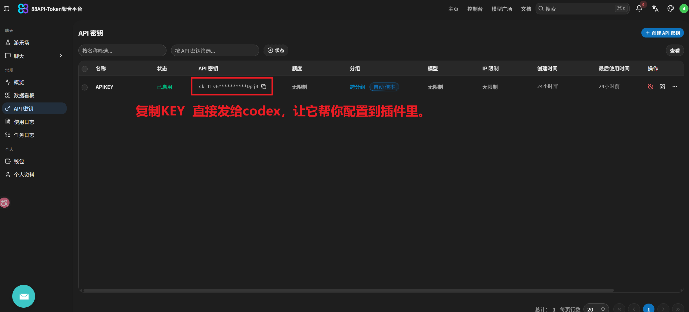

# 88API-image-gen

来自 [88api.ai](https://88api.ai/) Token 聚合站的 Codex 专用生图插件。支持文生图、参考图编辑、多参考图、透明 PNG、批量任务和本地保存。

| 模型 | 定位 | 适合场景 |
| --- | --- | --- |
| `gpt-image-2`（默认） | 2K | 日常生成和常规编辑 |
| `gpt-image-2-4k` | 4K | 用户明确要求普通 4K |
| `gpt-image-2-adobe` | 4K / 自定义 | 透明背景、21:9 等少见比例、自定义尺寸或明确要求 Adobe |

插件只需配置一个 88API Key。创建 Key 时选择 `auto`（自动分组），并发与渠道分配由 88API 上游完成。

## 环境

- Codex 插件功能
- Node.js 18 或更高版本
- 一个能调用上述模型的 88api.ai Key

## 创建并配置 88API Key

### 1. 创建 Key

登录 [88api.ai](https://88api.ai/)，进入“API 密钥”，创建一个 Key。名称可以自定义，分组选择 `auto`；如需渠道失败后继续尝试，可开启“跨分组重试”。


### 2. 复制 Key

复制创建好的完整 Key。



截图复用自 [88api-Nano-Banana](https://github.com/blackdm666/88api-Nano-Banana) 当前版本。

### 3. 让 Codex 自动安装并配置

复制下面整段到一个新的 Codex 任务，并替换其中的 Key：

```text
请帮我安装并配置最新版 88API-image-gen 插件。

插件仓库：
https://github.com/blackdm666/88API-image-gen

88API Key：
<把完整 Key 粘贴在这里>

要求：
1. 从上述仓库安装或更新 88api-image-gen@88api-plugins，不要安装其他同名来源。
2. 将 Key 保存到插件专用配置文件；不要完整显示 Key。
3. 运行配置检查、模型列表、自测、dry-run 和插件状态检查；只做无付费验证。
4. 简要告诉我安装版本、配置文件路径和验证结果，并提醒我新建任务后通过 @ 调用插件。
```

已经安装插件时，只需把下面的话和 Key 发给 Codex：

```text
请使用已安装的 88API-image-gen 保存下面这一个 Key，然后运行配置检查和无付费自测。不要调用付费生图接口，也不要完整显示 Key。

88API Key：
<把完整 Key 粘贴在这里>
```

Key 只应粘贴到自己的 Codex 任务，不要发布到 Issue、公开聊天、仓库或截图里。安装或升级完成后请新建任务，让插件重新加载。

## 在 Codex 中使用

在新任务中输入 `@`，选择 **88API-image-gen**，然后直接描述需求：

```text
@88API-image-gen 生成一张 16:9 的雨夜城市海报。
@88API-image-gen 用 4K 生成一张产品主视觉。
@88API-image-gen 生成透明背景 PNG，只保留产品主体。
@88API-image-gen 生成一张 21:9 超宽屏主视觉。
@88API-image-gen 生成一张精确 3000x777 像素的横幅。
@88API-image-gen 使用我附加的人物图和产品图，生成一张 16:9 的 4K 展示图。
@88API-image-gen 根据这个要求生成 3 张不同方案。
```

普通用户不需要运行 PowerShell，也不需要了解 CLI 参数；Codex 会负责选择模型、调用脚本并显示保存结果。

## 功能说明

- 用户只说“4K”时，单次使用 `gpt-image-2-4k`。
- 透明背景、少见比例和自定义尺寸自动使用 `gpt-image-2-adobe`。
- 编辑时可以附加多张参考图，插件会按顺序上传。
- 一个 Key 可以执行多图、批量和 workflow；每张图片仍是独立请求，可能分别计费。
- 需要批量处理时，可以先让 Codex 做 dry-run，核对模型、尺寸和任务数后再执行。
- 只有明确说“以后默认使用某模型”时，才会修改长期默认。

Image2 原生比例：`1:1`、`3:2`、`2:3`、`4:3`、`3:4`、`16:9`、`9:16`、`2:1`、`1:2`、`7:4`、`4:7`。其他合法比例自动路由 Adobe；`21:9` 默认解析为 `3808x1632`。

`gpt-image-2` 的 16:9 为 `2048x1152`，两款 4K 模型为 `3840x2160`。自定义尺寸每边不超过 `16384`，总像素不超过 `67108864`。

## API 与安全

- 文生图：`POST https://88api.ai/v1/images/generations`
- 图片编辑：`POST https://88api.ai/v1/images/edits`
- 协议始终是 OpenAI Images API，不使用 Chat Completions 或 `/v1/responses`。
- 透明后处理只改变保存的图片，不改变 88API 请求端点或认证方式。
- dry-run 和自测不会调用付费生图接口，也不会输出 Key 或参考图 Base64。
- 请求已经受理或状态未知时会标记 `[NO-RETRY]`，插件不会自动重发或换模型。
- 不宣称 Adobe 模型具有未经验证的版权、授权或商业安全保证。

## 常见问题

- **没有 Key：**按上面的截图创建一个 `auto` 分组 Key，再把配置提示词发给 Codex。
- **`@` 菜单没有插件：**让 Codex 更新并重新安装插件，然后新建任务。
- **模型或 Adobe 路由不符合预期：**让 Codex 先做无付费检查，并汇报请求模型、实际模型和路由原因。
- **请求超时或出现 `[NO-RETRY]`：**先在 88API 使用日志确认状态，不要立即重新生成。

## 项目信息

- 版本：`1.0.0`
- GitHub：[blackdm666/88API-image-gen](https://github.com/blackdm666/88API-image-gen)
- 插件：`88api-image-gen@88api-plugins`
- 更新说明：[docs/更新说明-v1.0.0.md](docs/更新说明-v1.0.0.md)
