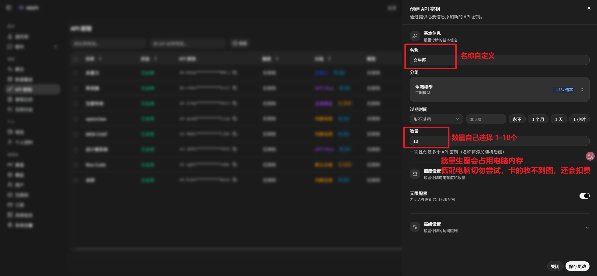
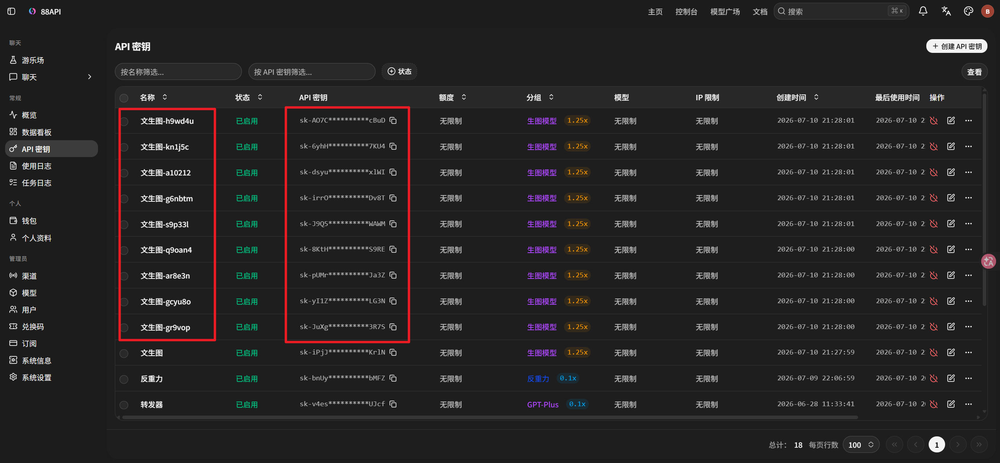

# 88API-image-gen

> 来源于 [88api.ai Token 聚合站](https://88api.ai/) 的 Codex 专用生图插件。

`88API-image-gen v0.4.0` 基于 `gpt-image-2`，由 Codex 当前会话模型理解需求并整理提示词，提供文生图、图生图、多参考图、流式预览、批量任务及最多 10 个 worker 的调度能力。

> [!CAUTION]
> **低配置电脑切勿批量生图或启用多个 worker。** 本地卡死、断网、Codex 崩溃或图片保存失败，不会撤销已经提交到 88API 云端的请求；云端已受理或完成的任务仍可能计费。首次使用请保持单 Key、单 worker、`--concurrency 1`。

## v0.4.0 核心能力

- 核心生图模型为 `gpt-image-2`。
- Codex 自动整理提示词、识别参考图角色；用户要求原文直传时不改写。
- 所有任务只使用 Image2 Images API，不需要 GPT‑5.5 或其他文本模型权限。
- 文生图显式使用 `--preview` 时，通过 Images API 原生 SSE 获得真实 partial-image 预览。
- 支持文生图、单图编辑、多参考图编辑、连续出图和通用批量工作流。
- 支持断点续跑、失败补洞、任务报告和最多 10 个独立 worker。
- 已受理或状态未知的请求标记为 `[NO-RETRY]`，禁止自动重发或跨接口回退，避免重复扣费。
- 上游像素不精确时，插件在 Windows、macOS 和 Linux 本地完成精确尺寸处理。

## 安装

### 环境要求

- Codex
- Node.js 18 或更高版本，推荐 Node.js 20+
- 可以访问 GitHub 和 88API
- 至少一个 88API“生图分组 Key”

插件运行不需要 Python、pip、虚拟环境或额外 npm 包。

```bash
node --version
```

精确尺寸处理使用：

- Windows：PowerShell 和系统图形组件，通常无需安装。
- macOS：系统自带 `sips`。
- Linux/Unix：需要 ImageMagick，确认 `magick` 或 `convert` 可用。

### 让 Codex 安装

把仓库地址 [blackdm666/88API-image-gen](https://github.com/blackdm666/88API-image-gen) 交给 Codex，并告诉它：

> 安装仓库中的 `88api-image-gen` 插件，检查 Node.js 和本地图片处理环境；如果没有配置 Key，提醒我先去 88api.ai 创建生图分组 Key。

也可以手动安装：

```bash
codex plugin marketplace add blackdm666/88API-image-gen
codex plugin add 88api-image-gen@88api-plugins
```

已经添加过 marketplace 时，只执行第二条命令。插件无需启动常驻服务，安装并配置 Key 后直接在 Codex 对话中提出生图需求即可。

## 首次配置 Key

### 1. 创建生图分组 Key

登录 [88api.ai](https://88api.ai/) 后进入“API 密钥”页面：

1. 点击“创建 API 密钥”。
2. 名称自定义，分组选择“生图模型”。
3. 第一次使用将数量设为 `1`；只有确实需要并行生成多张独立图片时才增加。
4. 按需设置额度和过期时间并保存。



创建完成后确认 Key 为“已启用”、分组为“生图模型”，再复制 Key。



截图中的 Key 已脱敏。不要把真实 Key 写入 README、Git 提交、日志或聊天回复。

### 2. 保存第一个 Key

将占位符替换为真实 Key：

```powershell
node "$HOME/plugins/88api-image-gen/scripts/generate.mjs" --set-key "<YOUR_88API_IMAGE_GROUP_KEY>"
node "$HOME/plugins/88api-image-gen/scripts/generate.mjs" --get-config
```

出现以下内容即表示成功：

```json
{
  "密钥状态": "已配置",
  "已配置密钥数": 1
}
```

配置保存在本机 `~/.codex/88api-image-gen-config.json`，查看配置时只显示脱敏摘要。

### 3. 可选：增加 worker

一个 Key 就能正常使用。多个 Key 只会并行处理多张独立图片，不会加速单张图片。

```powershell
node "$HOME/plugins/88api-image-gen/scripts/generate.mjs" --add-worker-key "<ANOTHER_IMAGE_GROUP_KEY>" --worker-name worker-2
node "$HOME/plugins/88api-image-gen/scripts/generate.mjs" --list-workers
```

worker 上限为 10，但低配置电脑不要配置多个。

## 使用

默认输出目录：`~/Pictures/88api-image-gen`。

### 文生图

```powershell
node "$HOME/plugins/88api-image-gen/scripts/generate.mjs" --prompt "在河边钓鱼的小狗" --aspect 16:9
```

需要真实中间预览时显式开启：

```powershell
node "$HOME/plugins/88api-image-gen/scripts/generate.mjs" --prompt "在河边钓鱼的小狗" --aspect 16:9 --preview
```

partial image 可能增加图像输出用量或费用，具体以 88API 控制台为准；批量任务不要开启预览。

### 图生图与多参考图

```powershell
node "$HOME/plugins/88api-image-gen/scripts/generate.mjs" --edit --image "C:\path\input.png" --prompt "改成 9:16 竖版商业海报" --aspect 9:16

node "$HOME/plugins/88api-image-gen/scripts/generate.mjs" --edit --image "C:\path\person.png" --image "C:\path\product.png" --prompt "保持人物身份，准确使用产品特征生成展示图" --aspect 9:16
```

参考图按命令参数顺序通过 multipart `image[]` 传入同一个 Images edit 请求，不会先拼图。单次最多 10 张。

### 多张与批量任务

```powershell
# 同一提示词生成多张，范围 1..9
node "$HOME/plugins/88api-image-gen/scripts/generate.mjs" --prompt "产品商业海报" --count 2 --concurrency 1

# 连续生成，范围 1..50
node "$HOME/plugins/88api-image-gen/scripts/generate.mjs" --prompt "产品商业海报" --repeat 2 --concurrency 1

# 多个不同提示词
node "$HOME/plugins/88api-image-gen/scripts/generate.mjs" --batch-inline "提示词一" "提示词二" --concurrency 1

# 每张源图分别编辑
node "$HOME/plugins/88api-image-gen/scripts/generate.mjs" --batch-edit --edit --image "C:\path\one.png" --image "C:\path\two.png" --prompt "分别生成商品海报" --concurrency 1
```

批量前确认内存充足和请求数量。`429/502/503/504/524` 等请求受理前错误可以重试；`[NO-RETRY]` 表示任务可能已被云端受理，插件不会重发。

### 通用批量图生图工作流

适合“固定参考图 + 一批变量图 + 多个场景模板”。任务总数等于变量图数量乘以模板数量，必须先 `--dry-run`：

```powershell
node "$HOME/plugins/88api-image-gen/scripts/generate.mjs" --workflow-batch-edit --fixed-ref "<固定参考图.png>" --item-dir "<变量图目录>" --template-inline "保持主体特征，生成 9:16 展示图" --limit 1 --aspect 9:16 --concurrency 1 --dry-run
```

确认任务数量后去掉 `--dry-run`。工作流支持断点续跑、自动补洞，并生成：

- `manifest.json`
- `summary.csv`
- `failures.json`
- `sessions.json`

内置美甲试戴预设：

```powershell
node "$HOME/plugins/88api-image-gen/scripts/generate.mjs" --workflow-batch-edit --fixed-ref "<人物参考图.png>" --item-dir "<产品图目录>" --preset nail-tryon --limit 1 --concurrency 1 --aspect 9:16 --dry-run
```

## Image2 接口模式

| 参数 | 用途 |
| --- | --- |
| `--transport auto` | 兼容参数；自动使用 Images API |
| `--transport images` | 强制 `/v1/images/generations` 或 `/v1/images/edits` |
| `--preview` | 单个文生图任务使用 Images API SSE 保存真实 partial-image 预览，默认关闭 |

插件不调用 `/v1/responses`。图片生成使用 `/v1/images/generations`，图片编辑使用 `/v1/images/edits`；请求状态未知时不会自动重发。

## 比例与尺寸

插件固定使用以下 2K 比例矩阵，不接受任意 `--size`：

| 比例 | 尺寸 | 比例 | 尺寸 |
| --- | --- | --- | --- |
| `1:1` | `2048x2048` | `3:2` | `2048x1360` |
| `2:3` | `1360x2048` | `4:3` | `2048x1536` |
| `3:4` | `1536x2048` | `16:9` | `2048x1152` |
| `9:16` | `1152x2048` | `2:1` | `2048x1024` |
| `1:2` | `1024x2048` | `7:4` | `2208x1264` |
| `4:7` | `1264x2208` |  |  |

别名：`square=1:1`、`landscape=4:3`、`portrait=3:4`。

`5:4`、`4:5`、`3:1`、`1:3` 因上游兼容性问题暂时禁用。上游原始像素可能与目标值不同，插件会在本地完成精确裁剪和缩放；实际计费以 88API 控制台为准。

## 排错

- **没有 Key：**访问 88api.ai 创建生图分组 Key，再运行 `--set-key` 和 `--get-config`。
- **模型权限错误：**确认使用的是 88API“生图分组 Key”，并且可以访问 `gpt-image-2` Images API。
- **图片编辑失败：**确认路径存在、格式为 PNG/JPG/JPEG/WebP，并使用 `--edit --image`。
- **比例报错：**只使用上表支持的比例，不要传入 `--size`。
- **批量超时：**先降到 `--concurrency 1`；不要手动重发 `[NO-RETRY]` 任务，先到 88API 使用日志确认状态。
- **安装失败：**确认已添加 `blackdm666/88API-image-gen` marketplace，再安装 `88api-image-gen@88api-plugins`。

## 项目信息

- 版本：`0.4.0`
- GitHub：[blackdm666/88API-image-gen](https://github.com/blackdm666/88API-image-gen)
- marketplace：`88api-plugins`
- 插件：`88api-image-gen@88api-plugins`
- 更新说明：[docs/更新说明-v0.4.0.md](docs/更新说明-v0.4.0.md)
